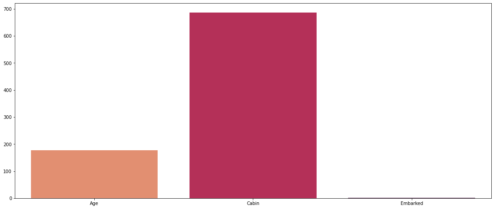
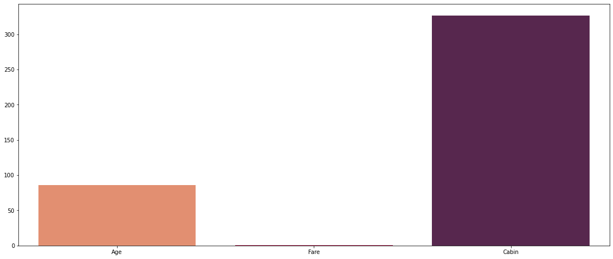

# Titanic Project, data exploration and data modeling


<!---->

## Sections

- [Titanic Project, data exploration and data modeling](#titanic-project-data-exploration-and-data-modeling)
  - [Sections](#sections)
    - [Libraries and tools used](#libraries-and-tools-used)
    - [Data adquisition](#data-adquisition)
    - [Data exploration](#data-exploration)
    - [Data preproccesing](#data-preproccesing)
    - [Data Modeling](#data-modeling)
    - [COnclusions](#conclusions)

### Libraries and tools used

Here are some libraries used for this projects

```python
import numpy as np
import pandas as pd
from sklearn.ensemble import RandomForestClassifier
import matplotlib.pyplot as plt
from termcolor import colored
import seaborn as sns
import warnings
from sklearn.preprocessing import OneHotEncoder, StandardScaler
from sklearn.preprocessing import MinMaxScaler
from sklearn import linear_model
from sklearn.metrics import accuracy_score
from sklearn.model_selection import train_test_split
warnings.simplefilter('ignore')
import platform
platform.system()
```

### Data adquisition

- The Data set was adquired via kaggle reposities on challenger chapter.
  - [kaggle.com](https://www.kaggle.com/competitions/titanic "Titanic Data Set")
- It was stored in a local device using git for version control and sync via GitHub.
  - [GitHub_Repository](https://github.com/Cesar421/Titanic "Cesar GitHub")
  
### Data exploration

Here we start the exploration of the data,

This is the .describe info of train data set

| **_#_**  | **_Column_**  | **_Non-Null Count_**  | **_Dtype_**  |  
|:-------: |:------------: |:--------------------: |:-----------: |
|  **0**   |  PassengerId  |     891 non-null      |    int64     |
|  **1**   |   Survived    |     891 non-null      |    int64     |
|  **2**   |    Pclass     |     891 non-null      |    int64     |
|  **3**   |     Name      |     891 non-null      |    object    |
|  **4**   |      Sex      |     891 non-null      |    object    |
|  **5**   |      Age      |     714 non-null      |   float64    |
|  **6**   |     SibSp     |     891 non-null      |    int64     |
|  **7**   |     Parch     |     891 non-null      |    int64     |
|  **8**   |    Ticket     |     891 non-null      |    object    |
|  **9**   |     Fare      |     891 non-null      |   float64    |
|  **10**  |     Cabin     |     204 non-null      |    object    |
|  **11**  |   Embarked    |     889 non-null      |    object    |

This is the .describe info of test data set

|  **#**  |    **Column**   | **Non-Null Count** | **Dtype** |
|:-------:|:---------------:|:------------------:|:---------:|
| **---** |    **------**   | **--------------** | **-----** |
|  **0**  | **PassengerId** |    418 non-null    |   int64   |
|  **1**  |    **Pclass**   |    418 non-null    |   int64   |
|  **2**  |     **Name**    |    418 non-null    |   object  |
|  **3**  |     **Sex**     |    418 non-null    |   object  |
|  **4**  |     **Age**     |    332 non-null    |  float64  |
|  **5**  |    **SibSp**    |    418 non-null    |   int64   |
|  **6**  |    **Parch**    |    418 non-null    |   int64   |
|  **7**  |    **Ticket**   |    418 non-null    |   object  |
|  **8**  |     **Fare**    |    417 non-null    |  float64  |
|  **9**  |    **Cabin**    |     91 non-null    |   object  |
|  **10** |   **Embarked**  |    418 non-null    |   object  |

Here we can see that C

```python

MISSING VALS IN THE TRAINING SET:
Age         177
Cabin       687
Embarked      2
dtype: int64

```



```python

MISSING VALS IN THE TEST SET:
Age       86
Fare       1
Cabin    327
dtype: int64

```



### Data preproccesing

It erase the Cabin, Name, Ticket and Cabin

- #### Numerical variables

```python
numeric = ['Age', 'SibSp', 'Parch', 'Fare']
X_numeric = df_train_original[numeric].values
scaler = MinMaxScaler(feature_range=(0, 1))  
X_numeric = scaler.fit_transform(X_numeric) 


```
  
- #### Categorical variables

```python

categoricalVars = ["Sex", "Embarked"]
oneHotEncoder = OneHotEncoder(sparse=False, drop="first")
trainEncoded = oneHotEncoder.fit_transform(df_train_original[categoricalVars])
encoderFeatureNames = oneHotEncoder.get_feature_names(categoricalVars)
trainEncoded = pd.DataFrame(trainEncoded,columns = encoderFeatureNames)
train = pd.concat([df_train_original.reset_index(drop=True),trainEncoded.reset_index(drop=True)],axis=1)
train.drop(categoricalVars,axis=1,inplace=True)

```

### Data Modeling

Model via random forest 

```python

y = train["Survived"]
print(y.shape)
features = ["Pclass", "Sex_male", "SibSp", "Parch"]
X = pd.get_dummies(train[features])
print(X.shape)
X_test = pd.get_dummies(test[features])
print(X_test.shape)
model = RandomForestClassifier(n_estimators=1000, max_depth=50, random_state=1)
model.fit(X, y)
predictions = model.predict(X_test)
print(predictions.shape)
print(df_test_original.shape)
output = pd.DataFrame({'PassengerId': df_test.PassengerId, 'Survived': predictions})
output.to_csv('my_prediction_Cesar.csv', index=False)
```

### COnclusions
