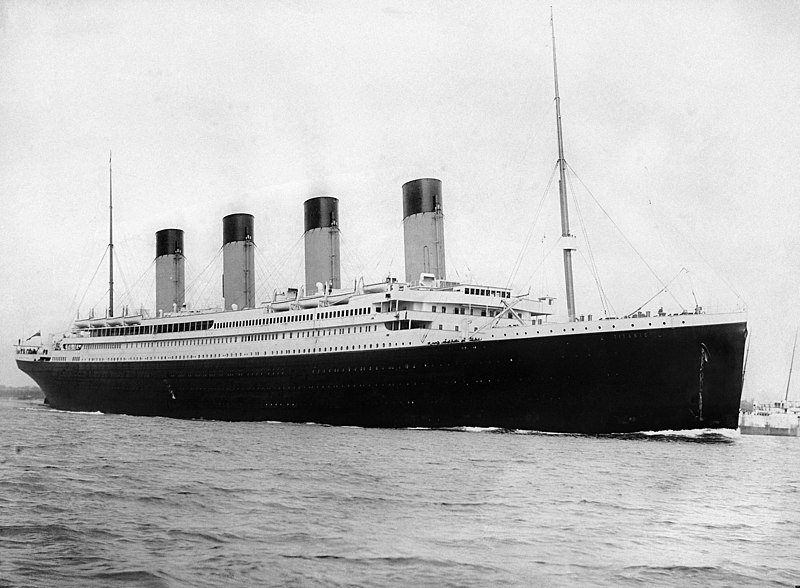

# Titanic Project, data exploration and data modeling

<!---->

## Data adquisition

* The Data set was adquired via kaggle reposities and challengers.
  * [kaggle.com](https://www.kaggle.com/competitions/titanic "Titanic Data Set")
* It was stored in a local device and sync via GitHub.
  * [GitHub_Repository](https://github.com/Cesar421/Titanic "Cesar GitHub")
  
## Data exploration

Here we start the exploration of the data,

## Data preproccesing

* ### Numerical variables
  
* ### Categorical variables
